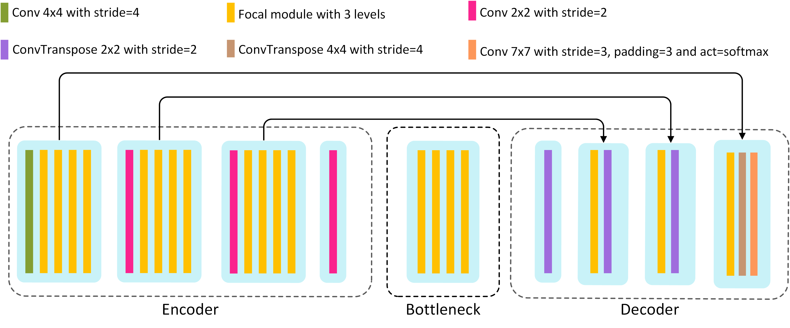
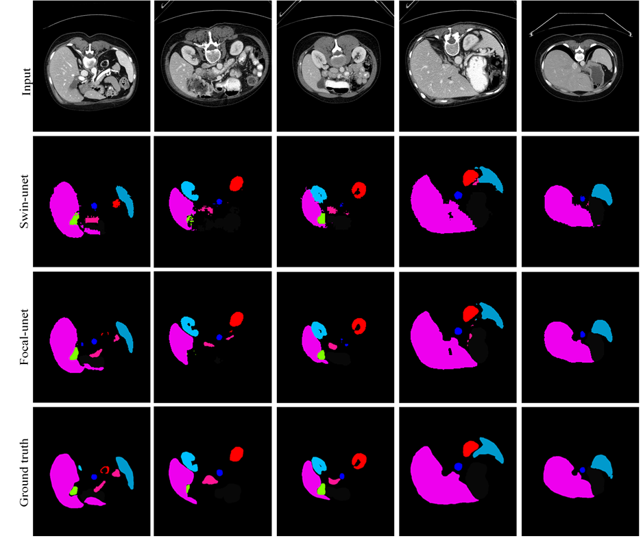
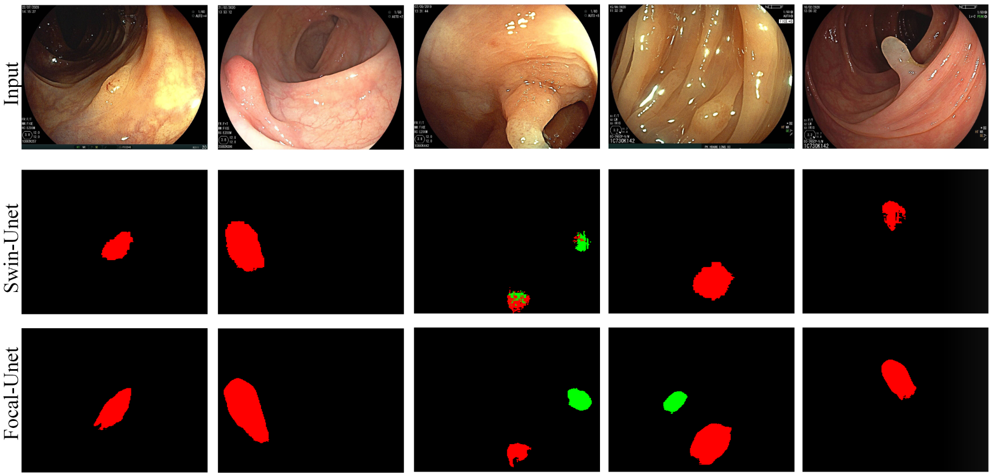

# Focal-Unet: Unet-like Focal Modulation for Medical Image Segmentation

[[arXiv](https://arxiv.org/abs/2212.09263)]

    
Abstract (click to view)

	Recently, many attempts have been made to construct a transformer base U-shaped architecture, and new methods have been proposed that outperformed CNN’s base rivals. However, serious problems such as blockiness and cropped edges in predicted masks remain because of transformers’ patch partitioning operations. In this work, we propose a new U-shaped architecture for medical image segmentation with the help of the newly introduced focal modulation mechanism. The proposed architecture has asymmetric depths for the encoder and decoder. Due to the ability of the focal module to aggregate local and global features, our model could simultaneously benefit the wide receptive field of transformers and local viewing of CNNs. This helps the proposed method balance local and global feature usage to outperform one of the most powerful transformer-based U-shaped models, Swin-UNet. We achieved a 1.68% higher DICE score and a 0.89 better HD metric on the Synapse dataset. Also, with extremely limited data, we had a 4.25% higher DICE score on the NeoPolyp dataset. 

    

Overview of the Focal-UNet architucture

---

## Our Results

    

The segmentation results of Swin-UNet and Focal-UNet on Synapse dataset

    

The segmentation results of Swin-UNet and Focal-UNet on NeoPolyp dataset

---

